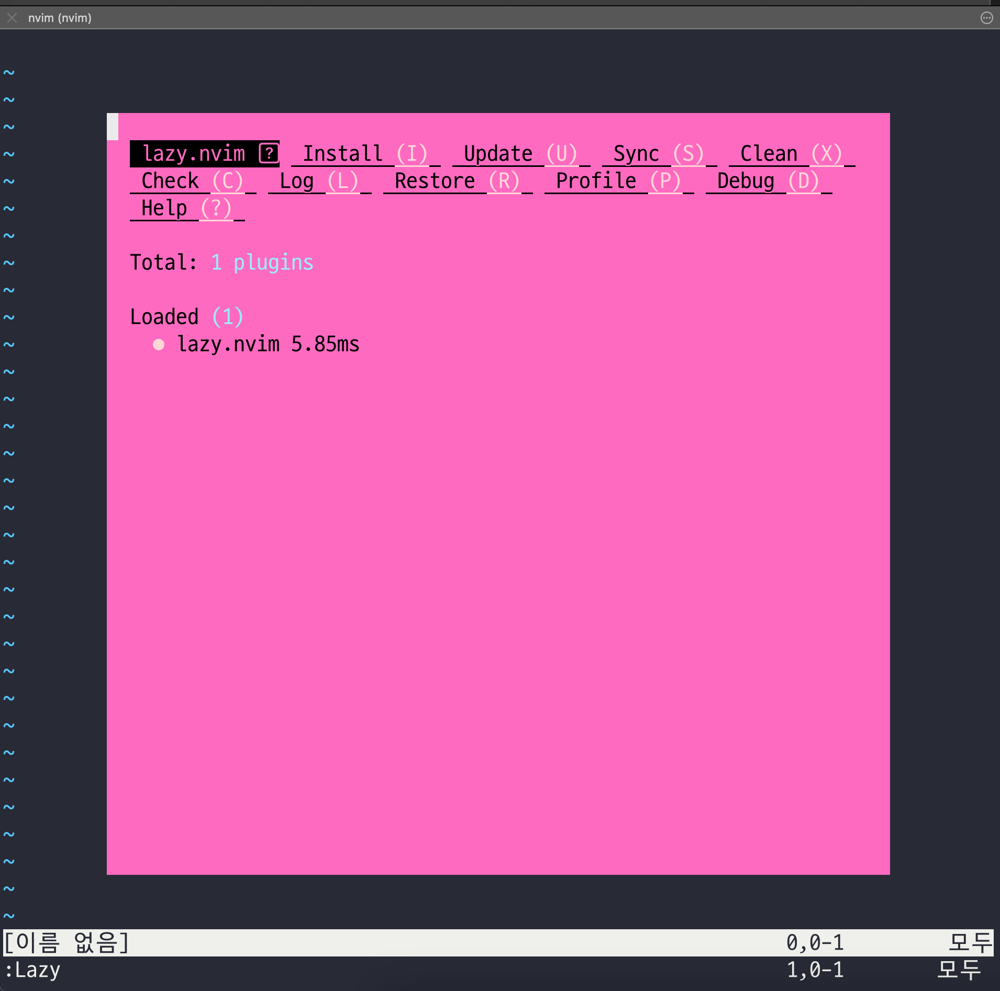
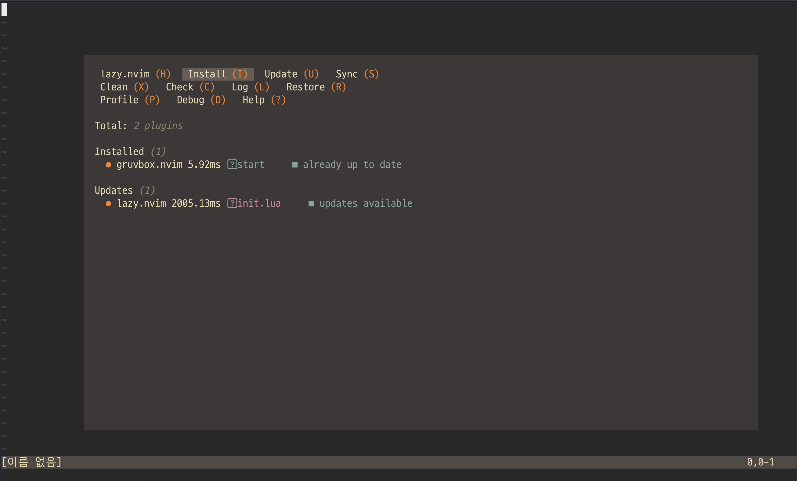
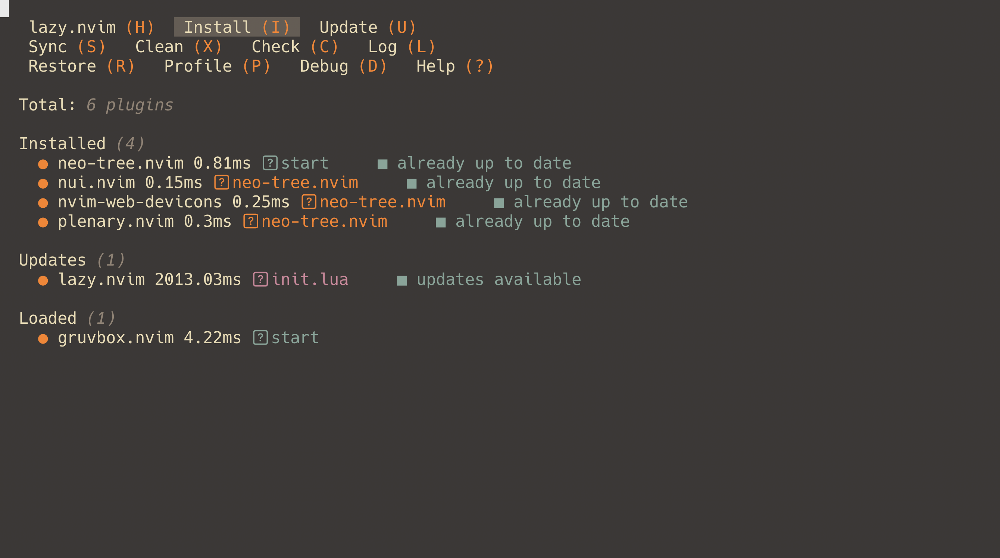
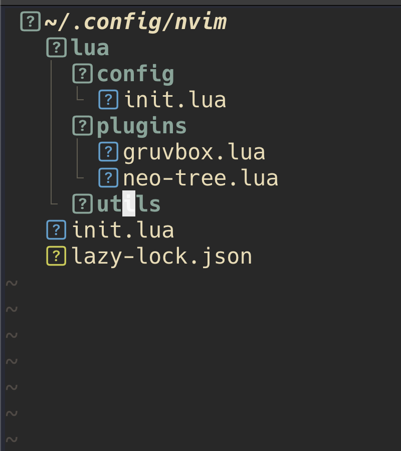
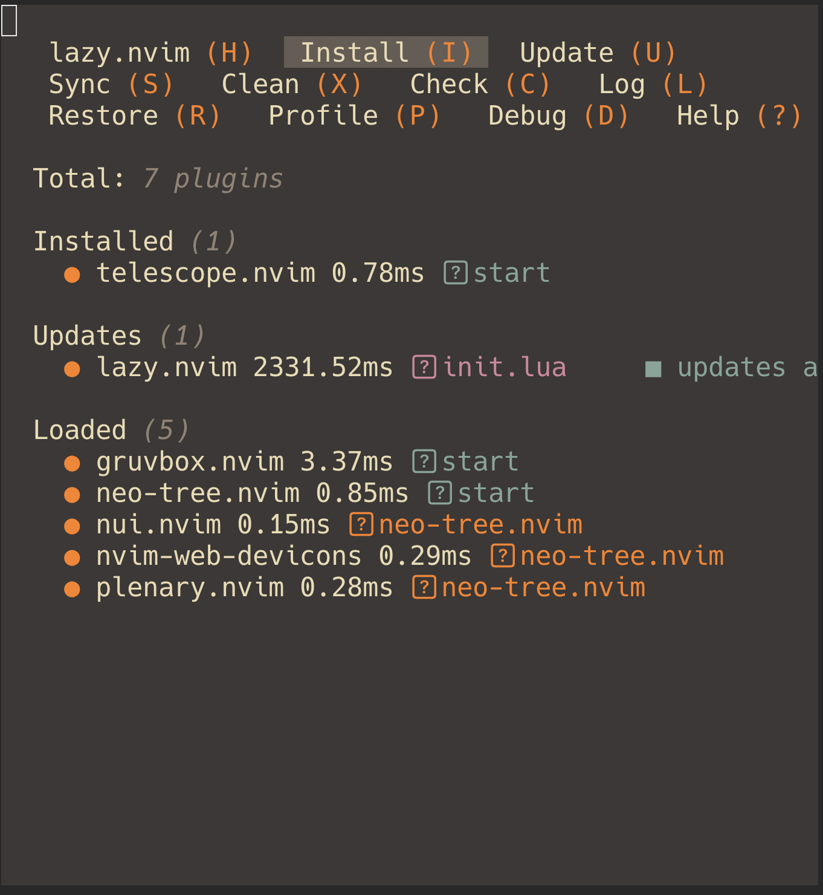
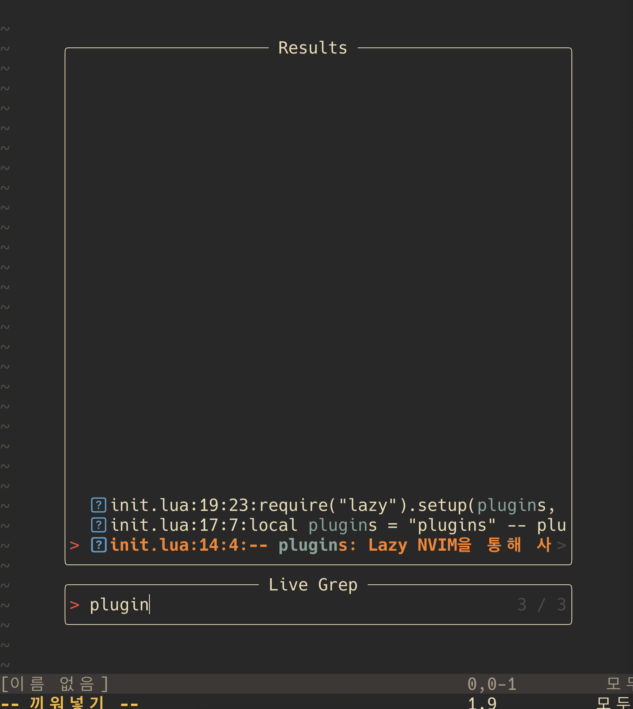

## Neo VIM 설치

```bash
brew install neovim
```

## 아래 디렉토리에 맞게끔 디렉토리 생성

```
~/.config
    /nvim
        /lua
            /config
            /plugins
            /utils
```

```bash
cd ~/.config

mkdir -p ./nvim/lua/config ./nvim/lua/plugins ./nvim/lua/utils
```

- NVIM은 기본적으로 `vim script`를 사용한다. 또한 `lua`를 사용한다.
- Unix기반 시스템에서는 `~/.config/nvim/lua`에 모듈들을 위치시켜야 한다

## lua 모듈 불러오기

lua 모듈을 불러올 때는 `require` 내장 함수를 사용하며 확장자를 붙여도, 붙이지 않아도 된다. 다른 모듈에서 불러올때도 마찬기지이다.

```lua
-- normal import
require("module.lua")
require("module")

-- 다른 모듈에 있는 lua
require("other/module.lua")
require("other/module")

-- init.lua 파일을 포함하는 폴더
require("module")
```

### Entrypoint 만들어주기

Entrypoint는 Neovim이 처음 구동될때 가장 먼저 시작하는 스크립트이다. 우선 `~/.config/nvim`으로 이동한다. 그 후 `nvim`으로 `init.lua`를 생성한다.

```bash
cd ~/.config/nvim

nvim init.lua
```

그 후 코드를 붙여넣기 해준다.

```bash
require("config")
```

이렇게 하면 `/lua/config`를 불러오게 해준다. 이번에는 `/lua/config/init.lua`를 생성해준다.

```bash
nvim /lua/config/init.lua
```

에러가 발생할 것이다. 무시하고 엔터를 친다.

### Lazy Nvim 설치하기

[Github](https://github.com/folke/lazy.nvim)

Lazy NVIM을 사용할 것이다. 이를 사용하면 아래와 같은 이점이 있다.

- UI를 통해 Plugin 관리
- 빠른 성능 및 Lazy Loading
- Plugin마다 우선순위를 줄 수 있다.

아래 코드를 `/lua/config/init.lua`에 붙여넣기 해준다(붙여준 후 저장). 이는 Lazy Nvim이 없으면 설치해준다.

```lua
local lazypath = vim.fn.stdpath("data") .. "/lazy/lazy.nvim"
if not (vim.uv or vim.loop).fs_stat(lazypath) then
  vim.fn.system({
    "git",
    "clone",
    "--filter=blob:none",
    "https://github.com/folke/lazy.nvim.git",
    "--branch=stable", -- latest stable release
    lazypath,
  })
end
vim.opt.rtp:prepend(lazypath)

-- plugins: Lazy NVIM을 통해 사용할 plugin 목록
-- opts: 추가적인 옵션 사항

local plugins = {}
local opts = {}
require("lazy").setup(plugins, opts)
```

Lazy가 잘 설치되었는지 확인을 위해서 NeoVim에 들어간 후 `:Lazy` 명령어를 입력한다. 그럼 아래와 같이 UI가 나오는것을 볼 수 있다.(안되었다면 설치가 잘못된것이다.)



## Plugin 활용하기

이에 앞서 `~/.config/nvim/lua/plugins` 디렉토리에 `lua` 파일을 만든다. 컨벤션은 아래와 같다.

```
(Plugin Name).lua
```

### Gruvbox Color Scheme

[Gruv Box Color Scheme Github](https://github.com/ellisonleao/gruvbox.nvim)

plugin 디렉토리에 `gruvbox.lua`파일을 생성해주고 아래 코드를 붙여준다.

```lua
return {
	"ellisonleao/gruvbox.nvim",
	priority = 1000 ,
	lazy = false, -- lazy loading을 하지 말라고 명시한다. 즉 에디터 로드 시 바로 이 플러그인을 실행시키라는 의미이다.
	config = function()
		vim.cmd([[colorscheme gruvbox]])
	end,
}
```

이후 다시 `/lua/config/init.lua` 파일을 킨 후 local 변수 `plugins`를 아래와 같이 바꿔준다.

```
local plugins = "plugins" -- plugins의 모든 파일을 자동으로 불러온다
```

이후 `nvim`을 쳐서 들어가면 color scheme이 다운로드 및 적용되는걸 볼 수 있다.



### Neotree

`Neotree`는 Neovim에서 File Tree를 관리해주는 툴이다. 쉽게 말하면 탐색기이다.

[Github](https://github.com/nvim-neo-tree/neo-tree.nvim)

위와 동일하게 `/plugin` 디렉토리에 `neo-tree.lua`라는 파일을 만들어 주고 아래 코드를 입력해준다.(캐치해야할 것은 각 plugin github의 install script에 대해 return을 해주어야 한다.)

```lua
return {
    "nvim-neo-tree/neo-tree.nvim",
    branch = "v3.x",
    dependencies = {
      "nvim-lua/plenary.nvim",
      "nvim-tree/nvim-web-devicons", -- not strictly required, but recommended
      "MunifTanjim/nui.nvim",
      -- "3rd/image.nvim", -- Optional image support in preview window: See `# Preview Mode` for more information
    }
}
```

동일하게 `neo-tree`가 설치되었는지 확인한다.



Neovim에서 `:Neotree toggle`이라고 입력하면 아래와 같이 Filesystem Finder가 나오는것을 볼 수 있다.



### Telescope

Fuzzy Finding 기능을 가지고 있다. Fuzzy Finding은 말 그대로 검색을 할때 활용된다. 예를 들어 파일을 찾을때처럼 말이다. 또한 Live Grep이라는 기능을 제공한다. 이는 특정 문자를 입력했을때 관련 키워드를 보여주는 등의 역할을 한다.

Live Grep을 활용하기 위해서는 `ripgrep`이라는 패키지가 요구된다. 맥에서는 brew로 설치할 수 있다.

```
brew install ripgrep
```

이제 Telescope를 설치해보자.

[Github](https://github.com/nvim-telescope/telescope.nvim)

동일하게 `plugin` 폴더 안에 `telescope.lua`를 생성해주고 아래 코드를 붙여준다.

```lua
return {
    'nvim-telescope/telescope.nvim', tag = '0.1.6',
-- or                              , branch = '0.1.x',
      dependencies = { 'nvim-lua/plenary.nvim' }
    }
```

다시 neovim을 열면 아래와 같이 `telescope`가 설치된걸 볼 수 있다.



neovim에서 `:Telescope find_files`를 입력하면 루트부터 하위 디렉토리까지 파일을 찾을 수 있는 파인더가 나온다.

그 다음 Live Grep을 활용하면 아래와 같이 파일의 내용에서 찾아 검색 결과를 볼 수 있다.


